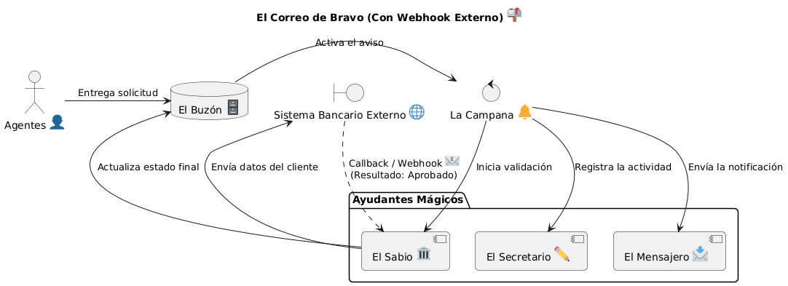
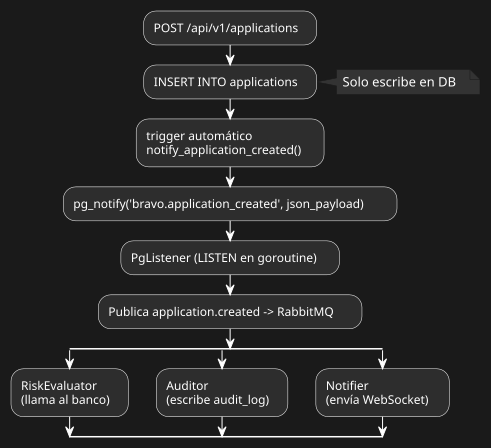

# Bravo Challenge

Sistema multi-país de solicitudes de crédito. Procesa préstamos en México y Brasil con validaciones específicas por país e integraciones bancarias. El backend está desarrollado en Go con el framework Echo, PostgreSQL, Redis y RabbitMQ.



---
**Analogía de una "Carta de Deseos**

Imaginen que nuestra aplicación es como una Oficina Postal Mágica:

- La Carta (Solicitud): Un niño (el Agente) escribe una carta pidiendo un deseo para un amigo de otro país.

- El Buzón Especial (Base de Datos): La carta se guarda en un buzón que nunca se llena y guarda todo con llave.

- La Campana (Aviso): En cuanto la carta cae al fondo, suena una campana que despierta a tres ayudantes mágicos para que trabajen al mismo tiempo.

Los Ayudantes Mágicos:

- El Sabio (RiskEvaluator): Llama por teléfono a los bancos de España o México para ver si el deseo es posible.

- El Secretario (Auditor): Anota en un libro de actas exactamente a qué hora llegó la carta para que no se pierda.

- El Mensajero (Notifier): Hace que el celular del jefe brille para avisarle: "¡Llegó una carta nueva!".

---

## Tabla de Contenidos

- [Descripción](#descripción)
- [Arquitectura](#arquitectura)
- [Flujo asíncrono](#flujo-asíncrono)
- [Países soportados](#países-soportados)
- [Endpoints](#endpoints)
- [Requisitos previos](#requisitos-previos)
- [Instalación y ejecución](#instalación-y-ejecución)
  - [Ejecución local](#ejecución-local)
  - [Docker Compose](#docker-compose)
  - [Kubernetes (Minikube)](#kubernetes-minikube)
- [Variables de entorno](#variables-de-entorno)
- [Tests](#tests)
- [Monitoreo](#monitoreo)

---

## Descripción

Bravo Challenge es una plataforma de solicitudes de crédito diseñada para operar en múltiples países. Cada país tiene su propio validador de identidad y su propia integración bancaria. El sistema desacopla la recepción de solicitudes del procesamiento de riesgo mediante una pipeline asíncrona basada en PostgreSQL LISTEN/NOTIFY y RabbitMQ.

**Características principales:**

- Validaciones de identidad específicas por país (CURP para MX, CPF para BR)
- Integraciones bancarias síncronas (MX) y asíncronas vía webhook callback (BR)
- Pipeline de procesamiento asíncrono orquestada por triggers de PostgreSQL
- Notificaciones en tiempo real vía WebSocket
- Idempotencia garantizada en POST/PUT mediante Redis + base de datos (TTL 24h)
- Autenticación JWT con control de acceso basado en roles (USER, AGENT, ADMIN — los ADMIN se crean manualmente)
- Métricas Prometheus y dashboards Grafana
- Documentación Swagger en `/swagger/*`

---

## Arquitectura

### Estructura del monorepo

```
bravo/
├── backend/          # API Go + workers
│   ├── cmd/          # main.go, server.go, routes.go
│   ├── internal/
│   │   ├── api/      # Handlers: auth, applications, health, webhook
│   │   ├── bank/     # Adaptadores bancarios por país (Strategy + Factory)
│   │   ├── cache/    # Cliente Redis
│   │   ├── config/   # Variables de entorno (go-envconfig)
│   │   ├── domain/   # Modelos: Application, User, Event
│   │   ├── queue/    # Cliente RabbitMQ
│   │   ├── repository/ # Acceso a datos PostgreSQL
│   │   ├── service/  # Lógica de negocio
│   │   ├── validation/ # Validadores por país (Strategy + Factory)
│   │   ├── websocket/  # Hub/Client gorilla/websocket
│   │   └── worker/   # Workers asíncronos: RiskEvaluator, Auditor, Notifier, PgListener
│   ├── migrations/   # Archivos SQL de migración
│   └── pkg/logger/   # Logging estructurado con zerolog
├── frontend/         # React (autenticación + dashboard)
├── wiremock/         # Simuladores de APIs bancarias
├── k8s/
│   ├── base/         # Manifests de Kubernetes
│   └── monitoring/   # Helm values para Prometheus + Grafana
└── tests/k6/         # Pruebas de carga e integración con k6
```

### Patrones de diseño

| Patrón | Aplicación |
|--------|------------|
| Strategy + Factory | Validadores y adaptadores bancarios por país |
| Repository | Desacoplamiento del acceso a datos |
| Middleware | JWT, idempotencia, logging |
| Hub/Client | WebSocket para notificaciones en tiempo real |
| Adapter | Integración con APIs bancarias externas |

### Servicios de infraestructura

| Servicio | Puerto | Propósito |
|----------|--------|-----------|
| PostgreSQL | 5432 | Base de datos principal |
| Redis | 6379 | Cache de idempotencia |
| RabbitMQ | 5672 | Cola de mensajes |
| RabbitMQ UI | 15672 | Consola de administración (guest/guest) |
| WireMock | 8080 | Simuladores de APIs bancarias |
| Grafana | 3000 | Dashboards (K8s vía Helm) |
| Prometheus | 9090 | Métricas (K8s vía Helm) |

---

## Flujo asíncrono

El mecanismo central del sistema es la pipeline asíncrona disparada por un trigger de PostgreSQL. La API solo escribe en la base de datos; el procesamiento de riesgo ocurre completamente de forma asíncrona.



**Pasos detallados:**


1. `POST /api/v1/applications` realiza un INSERT en la tabla `applications`.
2. El trigger `trg_application_created` ejecuta automáticamente la función `notify_application_created()`.
3. La función llama a `pg_notify('bravo.application_created', json_payload)` con el payload de la solicitud.
4. El worker `PgListener` (que mantiene una conexión LISTEN activa) recibe la notificación.
5. `PgListener` publica el evento `application.created` en RabbitMQ.
6. Tres workers consumen el evento en paralelo:
   - **RiskEvaluator**: llama al banco correspondiente (WireMock). Para MX (síncrono) actualiza el estado directamente; para BR (asíncrono) marca como `VALIDATING` y espera el callback del banco vía `POST /webhooks/bank-callback`.
   - **Auditor**: escribe un registro en `audit_logs`.
   - **Notifier**: envía una notificación en tiempo real al usuario vía WebSocket.

### Migraciones de base de datos

| Archivo | Contenido |
|---------|-----------|
| `001_init.sql` | Tablas: users, applications, idempotency_keys, processed_events, audit_logs |
| `002_add_role_to_users.sql` | Columna role + constraint chk_role |
| `003_pg_notify_trigger.sql` | Función `notify_application_created()` + trigger `trg_application_created` |

---

## Países soportados

| País | Código | Validador | Integración bancaria | Modo |
|------|--------|-----------|---------------------|------|
| México | MX | CURP (regex + códigos de estado + fecha) | WireMock `/mx/evaluate` | **Síncrono — activo** |
| Brasil | BR | CPF (checksum módulo 11) | `POST /webhooks/bank-callback` | **Asíncrono (webhook) — activo** |
| Colombia | CO | Formato CC | WireMock `/co/evaluate` | Síncrono (preparado) |
| España | ESP | Formato básico | WireMock `/esp/evaluate` | Síncrono (preparado) |
| Portugal | PT | Formato básico | WireMock `/pt/evaluate` | Síncrono (preparado) |
| Italia | IT | Formato básico | WireMock `/it/evaluate` | Síncrono (preparado) |

Para agregar un nuevo país: crear un adaptador bancario en `internal/bank/` y un validador en `internal/validation/`, luego registrarlos en los respectivos factories.

---

## Roles y permisos

El sistema tiene tres roles. El JWT incluye el rol en sus claims y cada endpoint lo verifica.

| Rol | Alta | Descripción |
|-----|------|-------------|
| `USER` | Registro en frontend / API | Usuario final que solicita créditos |
| `AGENT` | Registro en frontend / API | Agente de crédito con acceso ampliado |
| `ADMIN` | **Alta manual** en BD | Administrador del sistema |

> Los ADMIN se crean directamente en PostgreSQL:
> ```sql
> UPDATE users SET role = 'ADMIN' WHERE email = 'admin@bravo.test';
> ```

### Alcance de cada rol

| Acción | USER | AGENT | ADMIN |
|--------|:----:|:-----:|:-----:|
| Registrarse / iniciar sesión | ✓ | ✓ | ✓ |
| Crear solicitud de crédito | ✓ | ✓ | ✓ |
| Ver **sus propias** solicitudes | ✓ | ✓ | ✓ |
| Ver **todas** las solicitudes (cualquier usuario y país) | — | ✓ | ✓ |
| Obtener solicitud ajena por ID | — | ✓ | ✓ |
| Actualizar estado de solicitud (`PUT /applications/:id`) | — | ✓ | ✓ |
| Recibir notificaciones WebSocket de sus solicitudes | ✓ | ✓ | ✓ |

---

## Endpoints

### Autenticación

| Método | Ruta | Descripción |
|--------|------|-------------|
| POST | `/auth/register` | Registrar usuario (roles disponibles: `USER`, `AGENT`) |
| POST | `/auth/login` | Login, devuelve JWT |

### Solicitudes de crédito (requieren JWT)

| Método | Ruta | Descripción | Roles |
|--------|------|-------------|-------|
| GET | `/api/v1/applications` | Listar solicitudes (filtros: country, status, fecha) | Todos |
| POST | `/api/v1/applications` | Crear solicitud (requiere `Idempotency-Key` header) | Todos |
| GET | `/api/v1/applications/:id` | Obtener solicitud por ID | Todos |
| PUT | `/api/v1/applications/:id` | Actualizar estado (requiere `Idempotency-Key` header) | AGENT / ADMIN |

### Otros

| Método | Ruta | Descripción |
|--------|------|-------------|
| GET | `/ws?token=<JWT>` | Conexión WebSocket para notificaciones en tiempo real |
| POST | `/webhooks/bank-callback` | Callback entrante del banco (header `X-Webhook-Secret`) |
| GET | `/health` | Estado del servidor |
| GET | `/health_dependencies` | Estado de DB, Redis y RabbitMQ |
| GET | `/metrics` | Métricas Prometheus |
| GET | `/swagger/*` | Documentación Swagger UI |

---

## Requisitos previos

- Go 1.22 o superior
- Docker y Docker Compose
- Make
- Git
- (Opcional) Minikube y kubectl para despliegue en Kubernetes
- (Opcional) Helm para el stack de monitoreo

---

## Instalación y ejecución

### Ejecución local

```bash
# Clonar el repositorio
git clone <url-del-repo>
cd bravo

# Copiar variables de entorno y ajustar valores
cp backend/.env.example backend/.env

# Iniciar servicios de infraestructura
make docker-up

# Aplicar migraciones
make migrate

# Compilar y arrancar el backend
make run
```

El backend queda disponible en `http://localhost:8080`.
La documentación Swagger está en `http://localhost:8080/swagger/index.html`.

### Docker Compose

```bash
# Iniciar todos los servicios (PostgreSQL, Redis, RabbitMQ, WireMock)
make docker-up

# Ver logs en tiempo real
docker-compose logs -f

# Acceder a PostgreSQL
docker-compose exec postgres psql -U postgres -d bravo

# Consola de administración de RabbitMQ
# http://localhost:15672  (usuario: guest / contraseña: guest)

# Detener servicios
make docker-down

# Detener servicios y eliminar volúmenes
docker-compose down -v
```

### Kubernetes (Minikube)

```bash
# Construir imagen y aplicar manifests
make minikube-deploy

# Reconstruir y reiniciar pods
make minikube-reload

# Ejecutar migraciones en el PostgreSQL de K8s
make k8s-migrate

# Port-forward de la API a localhost:8000
make k8s-port-forward

# Ver estado de los pods
make k8s-status
```

---

## Variables de entorno

Todas las variables se cargan mediante `github.com/sethvargo/go-envconfig`. Las obligatorias están marcadas con `*`.

### Servidor

| Variable | Por defecto | Descripción |
|----------|-------------|-------------|
| `PORT` | `8080` | Puerto del servidor HTTP |
| `ENV` | `development` | Entorno de ejecución |
| `FRONTEND_URL` | — | URL del frontend (para CORS) |
| `CORS_ALLOWED_ORIGINS` | — | Orígenes permitidos en CORS (lista separada por comas) |
| `LOG_LEVEL` | `info` | Nivel de log (`debug`, `info`, `warn`, `error`) |
| `LOG_FORMAT` | `json` | Formato de log (`json`, `text`) |
| `MAX_RETRIES` | `3` | Reintentos máximos en operaciones |
| `REQUEST_TIMEOUT` | `30s` | Timeout de peticiones salientes |
| `IDEMPOTENCY_TTL` | `24h` | TTL de claves de idempotencia |

### Base de datos (PostgreSQL)

| Variable | Por defecto | Descripción |
|----------|-------------|-------------|
| `POSTGRES_SERVER` * | — | Host de PostgreSQL |
| `POSTGRES_DATABASE` * | — | Nombre de la base de datos |
| `POSTGRES_USER` * | — | Usuario |
| `POSTGRES_PASSWORD` * | — | Contraseña |
| `POSTGRES_PORT` | `5432` | Puerto |
| `POSTGRES_CONNECT_TIMEOUT` | `15` | Timeout de conexión (segundos) |
| `POSTGRES_MAX_OPEN_CONNS` | `30` | Conexiones máximas abiertas |
| `POSTGRES_MAX_IDLE_CONNS` | `25` | Conexiones máximas inactivas |
| `POSTGRES_CONN_MAX_LIFETIME` | `30` | Vida máxima de conexión (minutos) |
| `POSTGRES_QUERY_TIMEOUT` | `60` | Timeout de queries (segundos) |

### Redis

| Variable | Por defecto | Descripción |
|----------|-------------|-------------|
| `REDIS_HOST` * | — | Host de Redis |
| `REDIS_PORT` | `6379` | Puerto |
| `REDIS_PASSWORD` | — | Contraseña (opcional) |
| `REDIS_DB` | `0` | Número de base de datos Redis |

### RabbitMQ

| Variable | Por defecto | Descripción |
|----------|-------------|-------------|
| `RABBITMQ_HOST` * | — | Host de RabbitMQ |
| `RABBITMQ_PORT` | `5672` | Puerto |
| `RABBITMQ_USER` * | — | Usuario |
| `RABBITMQ_PASSWORD` * | — | Contraseña |

### Autenticación y seguridad

| Variable | Por defecto | Descripción |
|----------|-------------|-------------|
| `JWT_SECRET` * | — | Clave secreta para firmar tokens JWT |
| `WEBHOOK_SECRET` | `dev-webhook-secret` | Secreto para validar callbacks bancarios |

### URLs de bancos (WireMock)

Bancos simulados para validación de riesgo.

| Variable | Por defecto |
|----------|-------------|
| `MX_BANK_URL` | `http://localhost:8080/mx` |
| `BR_BANK_URL` | `http://localhost:8080/br` |

### Países asíncronos

| Variable | Por defecto | Descripción |
|----------|-------------|-------------|
| `ASYNC_BANK_COUNTRIES` | — | Lista de códigos de país que usan callback (ej. `BR`) |

---

## Tests

```bash
# Tests unitarios con verbose
go test ./internal/... -v

# Tests de integración
go test ./tests/integration/... -v

# Detección de race conditions
go test -race ./...

# Reporte de cobertura
go test -cover ./...

# Todos los tests (con race detection, vía Make)
make test
```

Los tests de integración requieren los servicios de infraestructura activos (`make docker-up`).

Para pruebas de carga con k6:

```bash
# Desde el directorio tests/k6/
k6 run <script>.js
```

---

## Monitoreo

El stack de monitoreo (Prometheus + Grafana) se despliega en Kubernetes vía Helm (kube-prometheus-stack).

```bash
# Instalar stack de monitoreo
make monitoring-install

# Port-forward: Grafana en :3000, Prometheus en :9090
make monitoring-forward

# Desinstalar stack de monitoreo
make monitoring-down
```

Las métricas de la aplicación se exponen en `GET /metrics` (formato Prometheus) a través de `echoprometheus`.

### Comandos Make de referencia

```bash
make run                # Iniciar infraestructura + backend local
make build              # Compilar binario
make test               # Tests con race detection
make swagger            # Regenerar docs Swagger
make migrate            # Aplicar migraciones (local)
make docker-up          # Iniciar servicios Docker
make docker-down        # Detener servicios Docker
make minikube-deploy    # Compilar imagen + aplicar manifests K8s
make minikube-reload    # Recompilar + reiniciar pods
make k8s-migrate        # Migraciones en PostgreSQL de K8s
make k8s-port-forward   # Port-forward API a localhost:8000
make k8s-status         # Estado de los pods
make monitoring-install # Instalar Prometheus + Grafana vía Helm
make monitoring-forward # Port-forward Grafana:3000 y Prometheus:9090
make monitoring-down    # Desinstalar stack de monitoreo
```

---

## Convenciones

### Commits

```
feat:     nueva funcionalidad
fix:      corrección de bug
docs:     documentación
test:     pruebas
refactor: refactorización sin cambio de comportamiento
```

### Ramas

```
main          producción
develop       staging
feature/xyz   nueva funcionalidad
bugfix/xyz    corrección de bug
```

### Formato de código

```bash
go fmt ./...
go vet ./...
```
